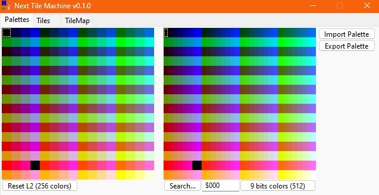
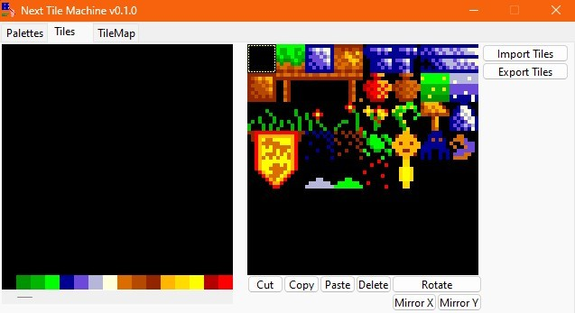
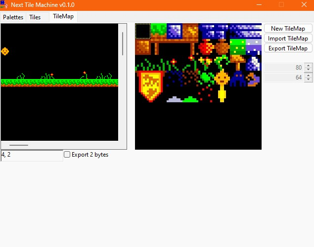

# Next Tile Machine
 This is a tool to draw tiles, tilemaps and palettes for the ZX Spectrum Next.
 It is programmed to be used in assembly z80, with hardware tiles.
 Made in Purebasic.

 Enjoy ;)
